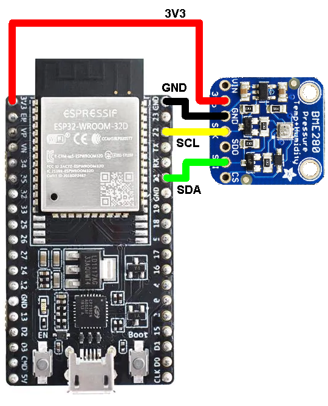

# SSV/SSB protocol for ESP32 Arduino platform

This is a basic sketch to advertise temperature, pressure, and humidity sensor data of the BME280 sensor via BLE using the SSV/SSB protocol. The following figure shows the required connections between the ESP32 DevKitC board and a BME280 board from Adafruit as an example.



To be able to upload the sketch to the ESP32 DevKitC board, you have to follow these steps:

1. Download and install the Arduino IDE level 1.8  or later from the official Arduino website.
    
2. Start Arduino and open the preferences window.

3. Enter the URL **https://dl.espressif.com/dl/package_esp32_index.json** into the Additional Board Manager's URL field. You can add multiple URLs separated by commas.

4. Open the Boards Manager from the *Tools > Board* menu, search and install the ESP32 platform. Then select your ESP32 board from the *Tools > Board* menu after the installation, e.g. *esp32 dev kit*.
       
After these steps the Arduino IDE can be used with an ESP32.

The generic libraries used in this sketch are already included in the installation files of the ESP32 boards addon. As we use some specific libraries for the sensors in this example, you'll have to add them to your environment to include them.

In this example the BME280 is used in *I2C mode*. Please download the BME280 library provided by Adafruit to get support for this interface (search for "bme280" in the *libraries menu* of the Arduino IDE).

Now you can dowload all files into this repository and put them into the default Arduino folder (where all your sketches are stored). Create a folder with the same name as the *.ino* file.

Now all libraries and files are installed and you can upload the sketch to your ESP32. If the upload does not work, check if you selected the right ESP32 board in the *Boards Manager* and if the setup of your COM port is correct. If the update status shows "Connecting to ----_____-----___" and the upload still does not work, you may have to press the *boot button* while uploading to the ESP32.

>>>
**OPTIONAL:**
If you want to edit/change sensors in this code version, you just have to edit the initializing functions and libraries for your sensor. Change the ``` get_bme280_val()``` method to get the data from your sensors instead. Everything else sould be left untouched. Further code specific information (e.g. function calls) can be found in the documenation of the Arduino code.
>>>
