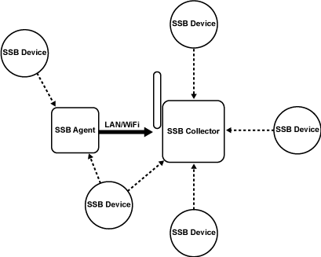
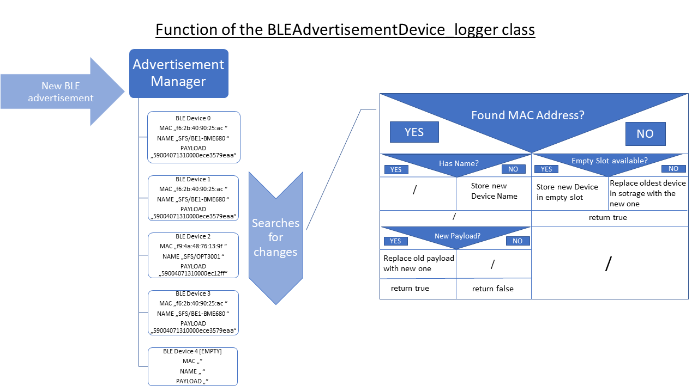

# esp32_ssv_ssb_agent

Use the ESP32 to scan for BLE Advertisements and publish them to MAC specific topics similar to our gateways.

> **On GitHub you can find a [detailed description of the SSB protocol](https://github.com/SSV-embedded/Secure-Sensor-Beacon-Protocol_SSB#readme).**

## Setup
1. Download the **PubSubClient library** with the integrated **Arduino Library Manager** by searching **PubSubClient** and install the library.
   Alternatively you may use the PubSubClient library given in the libraries folder of this repository. It may be an older version, but it works as intended.
2. Install all other libraries using the Arduino Library Manager or copy-paste the libraries from this repository to your libraries folder.
3. Compile the sketch and check for any error. Again make sure that all libraries are properly installed.
4. Upload the code to the ESP32.
5. When the ESP32 starts up for the very first time, it has no valid configuration. To enter some essential settings, the ESP32 shows up as an accesspoint.
   The SSID of each agent is individual, as it is derived from the **last 6 chars of the BLE MAC address**.
   Because this is an early version of the code, we use a pre-defined password: **123456789**
5. As soon as you connect to the esp32_ssv_ssb_agent it *should* open up a configuration website automatically. 
   Enter the **WiFi credentials of your network** and set the MQTT configuration to auto, or enter the **local IP of your MQTT broker**.
6. Set/Save the entered values by clicking the submit button. The ESP32 then saves the data, restarts and connects to the given network.
7. If something went wrong and the agent could not connect to the network or broker, it restarts itself into the accesspoint mode.
   The agent then will display the current WiFi settings on the configuration website.
8. Check and correct the credentials or change the MQTT configuration settings and submit the new settings to the agent again.

> **Important note: 
If you want to change the WiFi configuration of the SSB Agent, press and hold the *center button* on the Atom Lite boards and reset the ESP32 using the reset button. The esp32_ssv_ssb_agent then enters the WiFi accesspoint mode again where you can change configuration. 
(Nice usecase: Read the current config without making any changes! --> Bring the ESP32 into the accesspoint mode to read the current configuration. Then reset the ESP32 using the reset button without changing the configuration. The ESP32 then will continue operating in its agent mode.)**

# How it Works

## Configuration
At the first startup of the ESP32 it looks up for setup data in the nvs flash storage. If there are none, it enters accesspoint mode and waits for a connection.
As soon as a client connects to the accesspoint, the client is redirected to the configuration website using a captive portal. The captive portal was tested successfully on IOS, Windows 10, Linux, an older Android 6.0.1 and Android 11. With Samsungs Android 8 and 10 implementations the captive portal did not work as intended, but you have the option to go to **Router Settings** in the WiFi configuration of the smartphone. Follow the setup to enter the configuration webpage.  

When a configuration is submitted by the user, the ESP32 stores the configuration data in its nvs flash storage. It then starts up with the given setup, 
connects to the network and acts as a BLE agent.

## mDNS and MQTT
With a valid configuration in the nvs storage the ESP32 boots straight into the agent mode. It then tries to connect to the stored WiFi network.
If it fails, the firmware will restart and enter the accesspoint mode again, waiting for new configuration, as already described.
If the connection could be established, the ESP32 continues to look for some services. The firmware then tries to connect to a MQTT broker in the same network. 
By selecting the auto configuration during configuration, the ESP32 now searches the network for the mDNS service _ssb-mqtt._tcp.

This service is specific for the SSV SSB MQTT broker. If the ESP32 finds this service, it gets the IP of the MQTT broker and connects to it. If the configuration was set to manual, the ESP32 skips the mDNS sequence and simply connects to the IP address set in the configuration. If no mDNS service was found or the manual entered IP was wrong, the ssv_ssb_agent will reboot and enter accesspoint mode again to let the user correct the settings.

## Collecting and sending BLE advertisement 
The collected advertisements are sent to the MQTT broker formatted as a JSON-object. The publishing topic represents the BLE MAC address of the sensor which has sent BLE advertisement. This way it is possible to sort, assemble and validate the data from a specific sensor. The JSON-object itself contains the sensor data using the SSB protocol, the MAC address of the sensor, the ESP32 BLE MAC address, the name of the sensor and the "rssi" value.

During first tests with the ESP32 we observed memory overflows due to the dynamic memory allocation of the BLE library. Another side effect was, that it was not possible to keep the sensor names in memory reliably, as the ESP32 does not send a scan response request every time it receives an advertisement. To solve this problem, we decided to implement our own advertisement manager (BLEAdvertisedDevice_logger.h).

The main purpose of this manager is to store any specific data of a sensor and keep it in line with its BLE MAC address. Another important feature is filtering duplicate data. This helps to reduce overhead and goes fine with the SSB protocol.

In fact most devices send out static advertise data multiple times, to make sure that at least one of the packages is received by somebody. This behavior however would result in the ESP32 publishing the same BLE advertisement as many times as it had been received, regardless of the actual payload. We do not need these duplicates for sensor data processing.

The standard BLE library supports a **filter-mode**, which only triggers on the first advertisement of a specific BLE device. If you only look for a scan result this is o.k., but if you like to receive continuous payload data with the SSB protocol, we need to do it more specific. The SSB protocol may split the data in up to 16 fragments. With the built-in dumb **filter-mode** activated, only the first fragment would be received. So by using the SSB protocol, the payload data is different in every fragment. For the assembly and validation we have to collect them all. Therefore we have to filter the payload and the names on our own and the BLE Advertisement manager is our solution.

The BLE Advertisement manager is basically a lookup-table initiated with a fixed size and a fixed position in the heap. Whenever a new advertisement is received the manager searches for the BLE device MAC and compares the old payload with the new one. Only if the payload differs from the old one, or a completely new device is found, the data gets formatted and published via MQTT.

The following image shows how the advertisement logger works:

